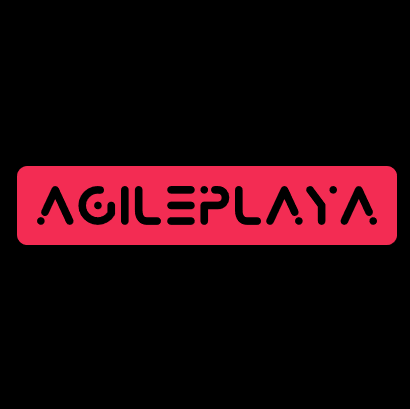

<!-- Depreciated. Older style
# Profile Home Page

### Project Phase 0

* Initializing and setting up the work environment.
* Understanding the requirements and learning the basics on how to create the profile page.
* Follow project timeline and workflow.

New style based on https://github.com/othneildrew/Best-README-Template
-->

<!-- PROJECT SHIELDS -->
<!--
*** I'm using markdown "reference style" links for readability.
*** Reference links are enclosed in brackets [ ] instead of parentheses ( ).
*** See the bottom of this document for the declaration of the reference variables
*** for contributors-url, forks-url, etc. This is an optional, concise syntax you may use.
*** https://www.markdownguide.org/basic-syntax/#reference-style-links
-->
[![Contributors][contributors-shield]][contributors-url]
[![Forks][forks-shield]][forks-url]
[![Stargazers][stars-shield]][stars-url]
[![Issues][issues-shield]][issues-url]
[![MIT License][license-shield]][license-url]
[![LinkedIn][linkedin-shield]][linkedin-url]


<!-- PROJECT LOGO -->
<br />
<p align="center">
  <a href="https://github.com/AgilePlaya/agileplaya.github.io/blob/main-gatsby-based/images/AgilePlaya-Logo.png">
    
  </a>

  <h3 align="center">AgilePlaya - Portfolio</h3>

  <p align="center">
    An portfolio created using NodeJS framework.
    <br />
    <br />
    <a href="https://agileplaya.github.io/">View Demo</a>
    ·
    <a href="https://github.com/AgilePlaya/agileplaya.github.io/issues/new?assignees=&labels=&template=bug_report.md&title=">Report Bug</a>
    ·
    <a href="https://github.com/AgilePlaya/agileplaya.github.io/issues/new?assignees=&labels=&template=feature_request.md&title=">Request Feature</a>
  </p>
</p>


<!-- TABLE OF CONTENTS -->
<details open="open">
  <summary>Table of Contents</summary>
  <ol>
    <li>
      <a href="#about-the-project">About The Project</a>
      <ul>
        <li><a href="#built-with">Built With</a></li>
      </ul>
    </li>
    <li>
      <a href="#getting-started">Getting Started</a>
      <ul>
        <li><a href="#prerequisites">Prerequisites</a></li>
        <li><a href="#installation">Installation</a></li>
      </ul>
    </li>
    <li><a href="#usage">Usage</a></li>
    <li><a href="#roadmap">Roadmap</a></li>
    <li><a href="#contributing">Contributing</a></li>
    <li><a href="#contact">Contact</a></li>
    <li><a href="#acknowledgements">Acknowledgements</a></li>
  </ol>
</details>


<!-- ABOUT THE PROJECT -->
## About The Project

[![Product Name Screen Shot][product-screenshot]](https://github.com/AgilePlaya/agileplaya.github.io/blob/main-gatsby-based/images/Home-Screen.png)

I wanted to build a webpage which would be able to better represent my knowledge and showcase my projects. or this purpose, I built this protfolio website. As for this readme file, it works as a template for my other github projects as well.

A list of resources that I used and also some other resources that I found really helpful are listed in the acknowledgements.

### Built With

These are the frameworks that I used to build this project.
* [Node JS](https://nodejs.org/en/)
* [GatsbyJS](https://www.gatsbyjs.com/)


<!-- GETTING STARTED -->
## Getting Started

This is an example of how you may give instructions on setting up your project locally.
To get a local copy up and running follow these simple example steps.

### Prerequisites

This is an example of how to list things you need to use the software and how to install them.
* npm
  ```sh
  npm install npm@latest -g
  ```

### Installation

1. Clone the repo
   ```sh
   git clone https://github.com/your_username_/Project-Name.git
   ```
2. Install NPM packages
   ```sh
   npm install
   ```
3. Modify src files as per your requirement `file.mdx`
4. Run the following command to start the project locally:
   ```
   gatsby develop
   ```


<!-- USAGE EXAMPLES -->
## Usage

Use this space to show useful examples of how a project can be used. Additional screenshots, code examples and demos work well in this space. You may also link to more resources.

_For more examples, please refer to the [GatsbyJS Cheat Sheet](https://www.gatsbyjs.com/docs/cheat-sheet/)_


<!-- ROADMAP -->
## Roadmap

See the [open issues](https://github.com/AgilePlaya/agileplaya.github.io/issues) for a list of proposed features (and known issues).


<!-- CONTRIBUTING -->
## Contributing

Contributions are what make the open source community such an amazing place to be learn, inspire, and create. Any contributions you make are **greatly appreciated**.

1. Fork the Project
2. Create your Feature Branch (`git checkout -b feature/AmazingFeature`)
3. Commit your Changes (`git commit -m 'Add some AmazingFeature'`)
4. Push to the Branch (`git push origin feature/AmazingFeature`)
5. Open a Pull Request


<!-- CONTACT -->
## Contact

Aritro Mukherjee - [@AgilePlaya](https://twitter.com/AgilePlaya) - [aritro-mukherjee](https://www.linkedin.com/in/aritro-mukherjee/)

Project Link: [https://github.com/AgilePlaya/agileplaya.github.io](https://github.com/AgilePlaya/agileplaya.github.io)


<!-- ACKNOWLEDGEMENTS -->
## Acknowledgements
* [Gatsby](https://www.gatsbyjs.com/)
* [LekoArts](https://github.com/LekoArts)
* [GitHub Emoji Cheat Sheet](https://www.webpagefx.com/tools/emoji-cheat-sheet)
* [Img Shields](https://shields.io)
* [README File](https://github.com/othneildrew/Best-README-Template)
* [GitHub Pages](https://pages.github.com)
* [Font Awesome](https://fontawesome.com)


<!-- MARKDOWN LINKS & IMAGES -->
<!-- https://www.markdownguide.org/basic-syntax/#reference-style-links -->
[contributors-shield]: https://img.shields.io/badge/Contributors-1-orange?style=for-the-badge
[contributors-url]: https://github.com/AgilePlaya/agileplaya.github.io/graphs/contributors
[forks-shield]: https://img.shields.io/badge/Forks-0-red?style=for-the-badge
[forks-url]: https://github.com/AgilePlaya/agileplaya.github.io/network/members
[stars-shield]: https://img.shields.io/badge/Stars-1-orange?style=for-the-badge
[stars-url]: https://github.com/AgilePlaya/agileplaya.github.io/stargazers
[issues-shield]: https://img.shields.io/badge/Issues-0-brightgreen?style=for-the-badge
[issues-url]: https://github.com/AgilePlaya/agileplaya.github.io/issues
[license-shield]: https://img.shields.io/badge/License-GPL3.0-brightgreen?style=for-the-badge
[license-url]: https://github.com/AgilePlaya/agileplaya.github.io/blob/main-gatsby-based/LICENSE
[linkedin-shield]: https://img.shields.io/badge/-LinkedIn-black.svg?style=for-the-badge&logo=linkedin&colorB=555
[linkedin-url]: https://www.linkedin.com/in/aritro-mukherjee/
[product-screenshot]: images/Home-Screen.png
